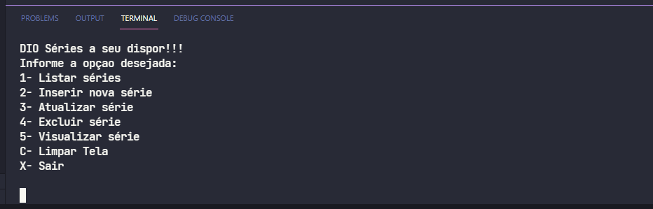

# Projeto: Criando um APP simples de cadastro de séries em .NET 

## Bootcamp .Net Fundamentals - Digital Innovation One

---

## .Net Fundamentals

Esse bootcamp é para as pessoas que estão iniciando sua carreira em desenvolvimento de software. Você aprenderá a desenvolver projetos em uma das linguagens de back-end mais utilizadas no mundo, o .NET C#, e a resolver algoritmos tendo um aprendizado completo, da teoria à prática.

